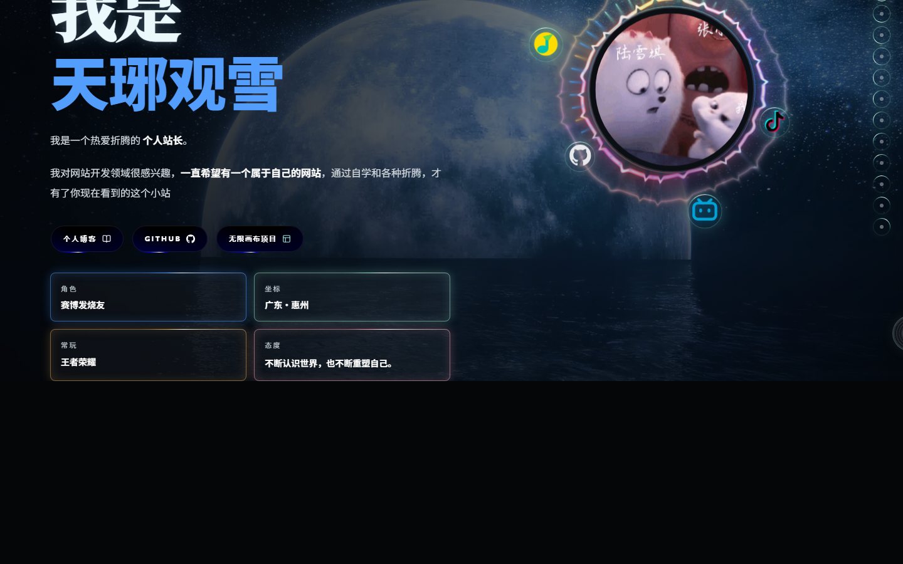

# 天琊观雪 · 个人主页

一个融合个人介绍、业务展示、音乐律动、旅行影像、时间线和留言互动的沉浸式个人网站。

- 公网站点：<https://my.tianyaguanxue.com/>
- 技术栈：Next.js 16、React 19、TypeScript、Tailwind CSS 4、GSAP、Motion、OGL
- 部署方式：韩国首尔节点上的 Docker standalone + Nginx，域名使用 DNS 直连



## 主要功能

- 月亮海面视频首屏、个人信息和社交入口；
- 音乐播放器、歌词与头像音频律动；
- “此刻所做”和业务服务卡片；
- 无限画布“映雪”项目入口；
- 照片墙、旅行画廊、个人时间线；
- 微信联系入口、留言墙与赞助展示；
- 桌面端和手机端响应式布局；
- 视口内启停视频与动画，兼顾视觉效果和性能。

## 本地运行

环境要求：Node.js 22、npm 10 或更高版本。

```bash
npm ci
npm run dev
```

访问 <http://localhost:3000>。

可选环境变量：

```bash
NEXT_PUBLIC_SITE_URL=http://localhost:3000
SITE_DATA_DIR=./data
WALL_BLOCKED_WORDS=词语1,词语2
```

## 提交前检查

```bash
npm run check
npm run build
```

`check` 会依次执行 ESLint、TypeScript 类型检查和 QQ 音乐公开试听接口测试。

## 目录结构

```text
src/app/                 页面、API 与全局样式
src/components/          音乐播放器和通用交互组件
src/lib/                 留言存储、QQ 音乐请求与工具函数
public/                  站点实际使用的图片、图标和视频
tests/                   接口测试
deploy/                  Docker Compose 与 Nginx 配置
docs/                    截图和生产维护说明
```

## Docker

```bash
docker build -t tianya-homepage:local .
docker compose -f deploy/docker-compose.prod.yml config
docker compose -f deploy/docker-compose.korea.yml config
```

生产环境将留言及运行时状态挂载到 `/opt/tianya-homepage/data`。不要把服务器上的 `data` 目录、音乐会话密钥、留言数据或 `.env` 提交到仓库。

发布边界和回退要求见 [docs/PRODUCTION.md](docs/PRODUCTION.md)。

## 来源与使用边界

页面结构基于 `ithte` / `liuyuyang` 项目进行二次开发，并在个人叙事、业务模块、视觉动画、音乐体验、照片与时间线等方向持续重构。

仓库未附带开源许可证时，不代表图片、视频、文字和个人素材可以被自由再发布。公开仓库前应再次确认素材授权；包含个人照片时优先使用私有仓库。
